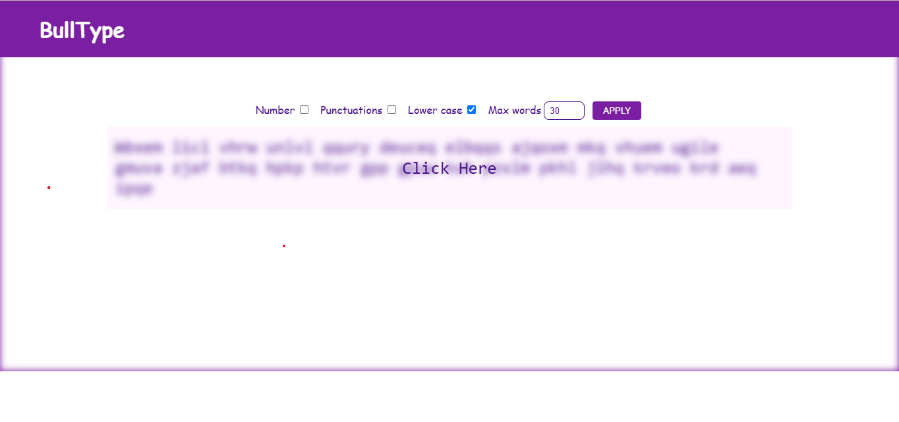
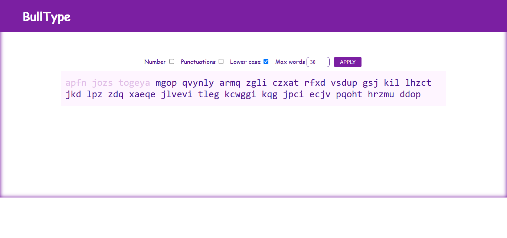
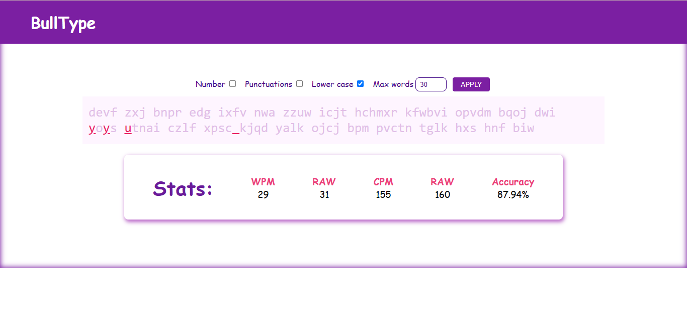

# Type Speed Testing App
>



## Overview

Welcome to the Type Speed Testing App! This project is a simple yet engaging web application that allows users to test and improve their typing speed. Built using HTML, CSS, and JavaScript, this app provides a fun way to challenge yourself and enhance your typing skills.

## Features

- **Real-time Typing Test**: Measure your typing speed in words per minute (WPM) with a variety of text samples.
- **User -Friendly Interface**: Clean and intuitive design for a seamless user experience.
- **Performance Tracking**: Keep track of your best scores and monitor your progress over time.
- **Responsive Design**: Works well on both desktop and mobile devices.

## Screenshots

Here are some screenshots of the app in action:




## Technologies Used

- **HTML**: For structuring the web application.
- **CSS**: For styling and layout.
- **JavaScript**: For implementing the typing test logic and interactivity.

## Getting Started

To run the Type Speed Testing App locally, follow these steps:

1. Clone the repository:
   ```bash
   git clone https://github.com/yourusername/type-speed-testing-app.git
   Navigate to the project directory:

2. Run
    Open index.html in your web browser.
